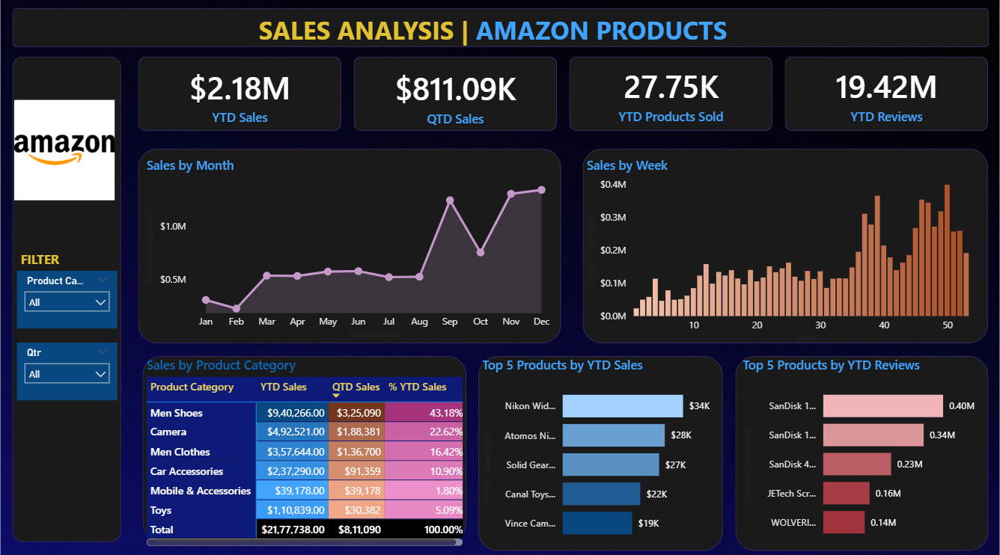

# 📊 Amazon Sales Dashboard  

## 📌 Project Overview  
The **Amazon Sales Dashboard** is an interactive Power BI project designed to analyze Amazon product sales.  
It provides insights into **Year-to-Date (YTD) Sales, Quarter-to-Date (QTD) Sales, Products Sold, and Customer Reviews**, helping in better decision-making and performance tracking.  

---

## 🚀 Features  
- 📈 **Key Metrics (KPIs)**: YTD Sales, QTD Sales, Products Sold, Reviews  
- 📊 **Sales Trends**: Monthly and Weekly sales performance  
- 🛍️ **Category-wise Sales Analysis**  
- ⭐ **Top 5 Products by Sales & Reviews**  
- 🎛️ **Interactive Filters**: Product category, Quarter selection  

---

## 🛠️ Tech Stack  
- **Power BI Desktop** – Dashboard creation  
- **Excel (`Amazon_Combined_Data.xlsx`)** – Dataset  
- **DAX** – Custom measures & calculations  
- **Power Query** – Data transformation & cleaning  

---

## 📂 Project Structure  
```
📦 Amazon-Sales-Dashboard
 ┣ 📄 amazon_sales.pbix            # Power BI dashboard file
 ┣ 📄 Amazon_Combined_Data.xlsx    # Dataset (combined Amazon sales data)
 ┣ 📄 amazon_sales_dashboard.png   # Dashboard screenshot
 ┗ 📄 README.md                    # Project documentation
```

---

## 🖼️ Dashboard Preview  
  

---

## 📊 Key Insights  
- **Total YTD Sales**: **$2.18M**  
- **QTD Sales**: **$811.09K**  
- **Products Sold (YTD)**: **27.75K**  
- **Customer Reviews (YTD)**: **19.42M**  
- **Top Category by YTD Sales**: *Men Shoes* (43.18%)  
- **Top Product by Sales**: *Nikon Wide Lens* ($34K)  
- **Top Product by Reviews**: *SanDisk 128GB* (0.40M reviews)  

---

## ⚙️ How to Use  
1. Download or clone this repository.  
2. Open the **`amazon_sales.pbix`** file in **Power BI Desktop**.  
3. Ensure **`Amazon_Combined_Data.xlsx`** is placed in the same folder (or update the data source path in Power BI).  
4. Refresh the dataset and interact with filters, charts, and KPIs.  

---

## 🔮 Future Enhancements  
- Add **sales forecasting models**.  
- Incorporate **geographical sales insights (maps)**.  
- Automate data refresh with **Power BI Service**.  
- Expand KPIs with **profit margin & customer segmentation**.  

---

## 🤝 Contributing  
Contributions, issues, and feature requests are welcome!  
Feel free to fork this repository and submit pull requests.  

---

## 📧 Contact  
👤 **Piyush Ranjan**  
- [LinkedIn](https://www.linkedin.com/in/piyush-ranjan-850638253)  
- [GitHub](https://github.com/Piyushranjan10)  
